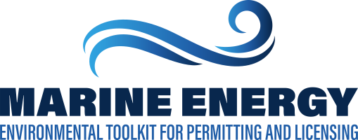

```{r setup, include=FALSE}
knitr::opts_chunk$set(echo = TRUE)

if (!require(librarian)){
  install.packages("librarian")
  library(librarian)
}
shelf(
  glue, here, shiny)


icon <- function(x){ shiny::icon(x, class="fa-4x primary") }
#sz <- "fa-4x"

# https://material-ui.com/customization/color/#color-tool
# Color tool: primary: blue; secondary: orange
# blues: #1769aa, #2196f3, #4dabf5
# oranges: #b26500, #ff9100, #ffa733
url_shiny <- "http://127.0.0.1:1234/"
```

<!--
#### Marine hydrokinetic (MHK) environmental compliance

Tools and resources for environmental compliance in support of projects for wave and tidal [i.e. marine hydrokinetic (MHK)] energy.
-->

<div class="content home">
  <div class="jumbotron jumbotron-fluid">
    <div class="container">
      <div class="row">
        <div class="col-12 col-md-8 offset-md-2 text-center">
          
          <p>The Marine and Hydrokinetic (MHK) Environmental Toolkit for Permitting and Licensing effort seeks to increase regulators' understanding of MHK projects and their potential environmental effects to reduce the amount of time to permit and decrease costs to develop MHK projects.</p>
          <a href="#" class="btn btn-primary btn-chubby btn-w-arrow">Learn More</a>
        </div>
      </div>
    </div>
  </div>
  <div class="container">
    <div class="row">
      <div class="col-12 col-md-10 offset-md-1 text-center">
        <h1>The Toolkit</h1>
        <p>Access tools and resources for environmental compliance in support of projects involving technologies that leverage the energy from marine and hydrokinetic (MHK) resources such as waves, tides, rivers, and ocean currents.</p>
      </div>
    </div>
  </div>
  <div class="container">
    <div class="row">
      <div class="col-12 col-md-4 text-center">
        <div class="icon-box">
          
          <h3>PROJECTS</h3>
          <p>An interactive map and project timelines with access to existing permitting documentation of previously permitted projects in the U.S.</p>
          <a href="#" class="btn-w-arrow">Learn More</a>
        </div>
      </div>
      <div class="col-12 col-md-4 text-center">
        <div class="icon-box">
          
          <h3>Data catalog, mapper<br>and reporting tool</h3>
          <p>Draw a polygon and generate a report compiling relevant spatial, academic, and regulatory information into one document.</p>
          <a href="#" class="btn-w-arrow">Learn More</a>
        </div>
      </div>
      <div class="col-12 col-md-4 text-center">
        <div class="icon-box">
          
          <h3>ENVIRONMENTAL<br>INTERACTIONS</h3>
          <p>Access papers on various environmental interactions from the Tethys Knowledge Base.</p>
          <a href="#" class="btn-w-arrow">Learn More</a>
        </div>
      </div>
    </div>
    <div class="row mt-5">
      <div class="col-12 col-md-4 text-center">
        <div class="icon-box">
          
          <h3>SEARCHABLE<br>DOCUMENTS</h3>
          <p>Documents relevant to projects, precedent and mitigation from various academic research and regulatory sources, including references from Tethys and FERC.</p>
          <a href="#" class="btn-w-arrow">Learn More</a>
        </div>
      </div>
      <div class="col-12 col-md-4 text-center">
        <div class="icon-box">
          
          <h3>GUIDELINES AND<br>FLOWCHARTS</h3>
          <p>Guidelines and flowcharts on applicable regulations, example documents, best practices, and other resources for federal (FERC, USACE, and BOEM) and state (AK, CA, FL, HI, OR, MA, ME, NY, RI, WA) processes.</p>
          <a href="#" class="btn-w-arrow">Learn More</a>
        </div>
      </div>
      <div class="col-12 col-md-4 text-center">
        <div class="icon-box">
          
          <h3>ABOUT<br>MARINE ENGERGY</h3>
          <p>Marine and hydrokinetic energy (MHK) is the harnessing of water’s kinetic energy to generate electricity. It encompasses wave, tidal, and river and ocean current power.</p>
          <a href="#" class="btn-w-arrow">Learn More</a>
        </div>
      </div>
    </div>
  </div>
</div>

<!--
TODO: think of scrolling sections with imagery and For more...

- https://www.integral-corp.com/

For more, see:

- [What is MHK? (OpenEI)](https://openei.org/wiki/MHK-env)
-->
